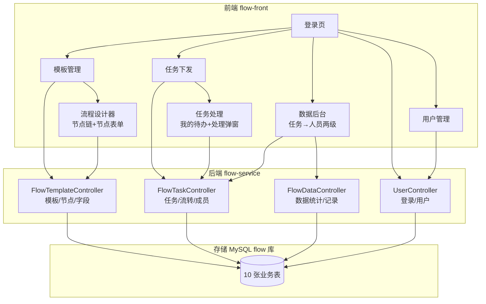
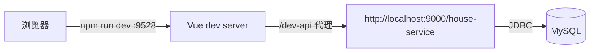
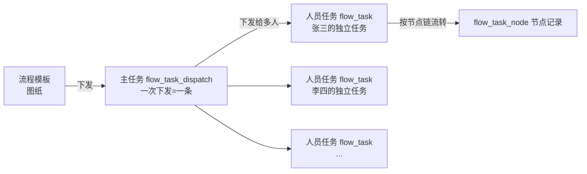
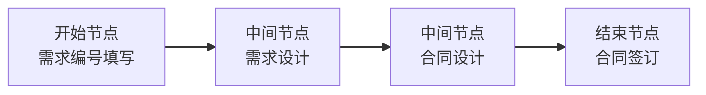
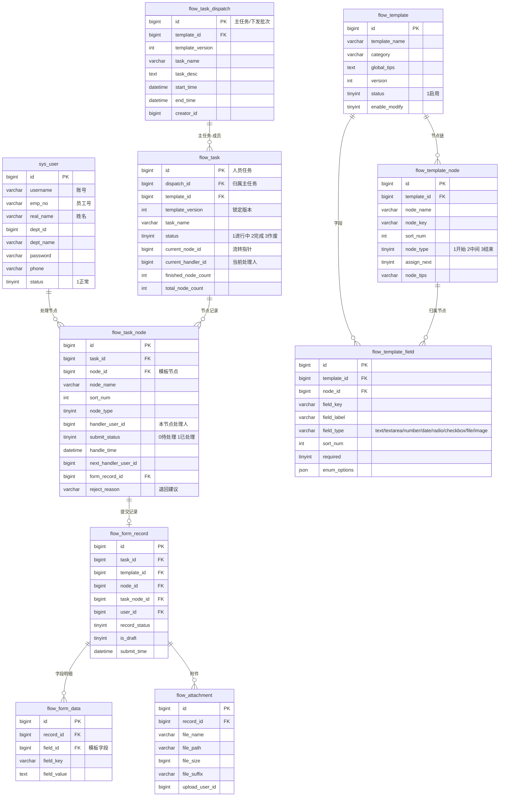
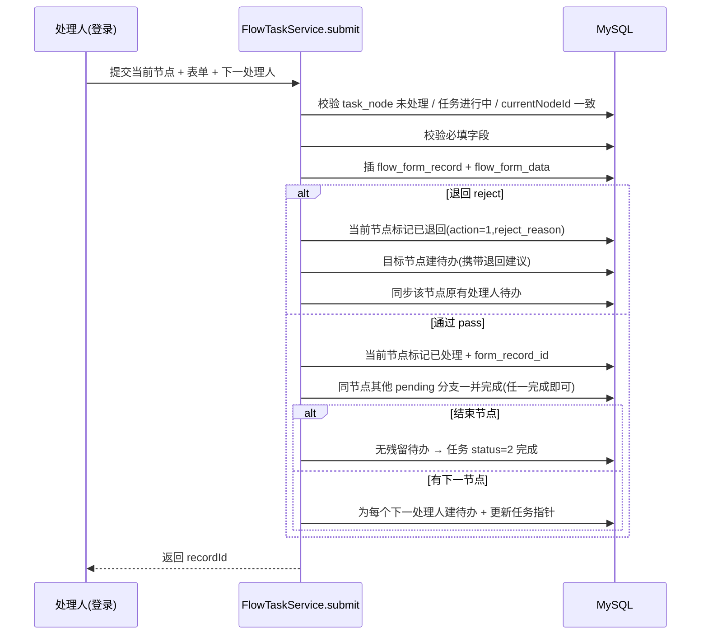
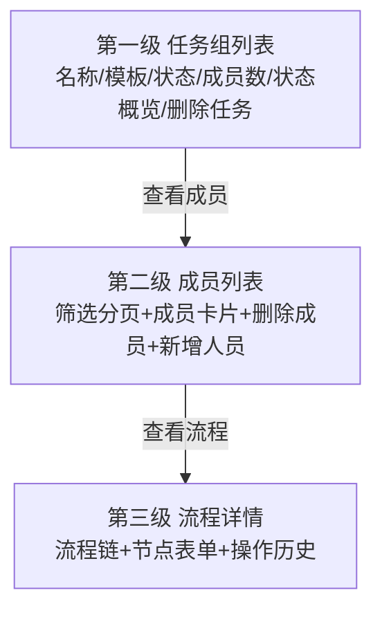
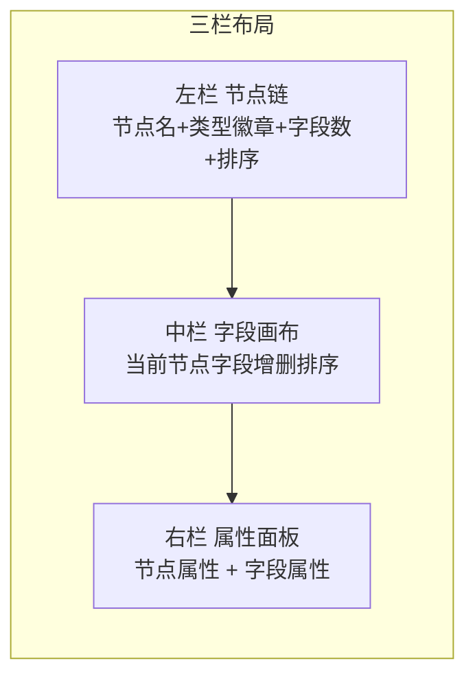

# 线性顺序流转工作流系统 · 项目开发文档

> 本文档覆盖系统概述、架构、数据库、后端、前端、API、核心流程与部署，供开发/维护/二次开发参考。

---

## 一、项目概述

### 1.1 业务场景

本系统是一个**线性顺序流转工作流**平台。管理员先**设计流程模板**——把一个业务（如"分散采购"）拆解为一条**有序的流程节点链**（下发 → 需求设计 → 合同设计 → 签订合同 → 结束）。每个节点配置自己要填写的表单字段。基于模板下发任务后，任务按节点**顺序逐个流转**：当前节点处理人填写本节点表单，提交时**指定下一节点的处理人**，依此推进，直到"结束"节点完成。

> **区别于并行表单收集**：不是所有人同时填一张表，而是一步一步往前走，每步处理人不同、每步填的字段不同。

### 1.2 角色

| 角色 | 职责 |
|---|---|
| **超级管理员 / 流程管理员** | 用户管理、流程模板设计、任务下发、查看流转数据 |
| **处理人** | 在"我的待办"接收当前节点任务，填表单、指定下一节点处理人、提交 |

### 1.3 核心能力

- 流程模板管理（启用/停用、版本管理、复制）
- **流程节点链设计**：可视化添加/排序节点，区分开始/中间/结束节点
- **节点级表单设计**：每个节点独立配置字段（文本/多行文本/数字/日期/单选/多选/文件/图片），含必填、占位、提示、枚举、长度限制等属性
- **任务下发**：基于模板创建**主任务**并下发给多人，每人一条**独立成员任务**
- **任务流转**：当前节点填写 → 指定下一处理人 → 顺序推进；**节点支持多处理人"任一完成即可"**；支持**退回重做**并保留退回建议
- **数据后台**：任务→人员两级查看，流转进度、各节点表单数据、操作历史
- **任务人员筛选分页**：按姓名/部门/状态过滤 + 分页

---

## 二、技术架构

| 层 | 技术 | 说明 |
|---|---|---|
| 前端 | Vue 2.6 + Element UI 2.13 + Vuex + Vue Router + Axios | vue-admin-template 基础改造 |
| 后端 | Spring Boot 3.4 + Java 21 | RESTful 接口 |
| ORM | MyBatis-Plus 3.5.5 | 实体+Mapper+XML 联表 |
| 认证 | JWT (jjwt) | 登录签发 token，`Authorization: Bearer` |
| 数据库 | MySQL 8 + InnoDB + utf8mb4 | 主键统一 bigint |
| 构建 | Maven 3.9 + vue-cli 4 | |

### 2.1 总体架构



### 2.2 前后端通信



前端 `.env.development` 设 `VUE_APP_BASE_API = /dev-api`，`vue.config.js` 代理 `/dev-api → http://localhost:9000/house-service`。

---

## 三、核心领域模型

### 3.1 模板 vs 任务 vs 人员任务



- **模板** = 图纸：节点链 + 每个节点的字段定义（`flow_template`、`flow_template_node`、`flow_template_field`）。
- **主任务** = 一次下发（`flow_task_dispatch`）：记录任务名、模板、时间。人员删空后主任务仍保留，可单独删除。
- **人员任务** = 每个被下发人的独立任务（`flow_task`，用 `dispatch_id` 归属主任务），各自按节点链独立流转，互不影响。

### 3.2 节点链



- 首节点强制类型 1（开始）、末节点强制类型 3（结束）。
- 每个节点可配置字段（`node_id` 归属）。

### 3.3 流转机制

- **正向流转**：处理人提交当前节点 → 指定下一节点处理人（可多选）→ 为每个处理人生成一条待办分支。
- **任一完成即可**：节点有多条待办分支（多处理人）时，**任一人提交即完成该节点**，其余待办自动消解，不留孤儿待办。
- **退回重做**：处理人可退回到已到达过的前置节点，携带**退回建议**；退回时同步该节点原有处理人的待办（并行处理人都能重新处理）。
- **任务完成**：结束节点提交（且无残留待办）→ 任务状态置为已完成。

---

## 四、数据库设计

数据库 `flow`，共 **10 张表**（`flow_task_user` 已废弃兼容保留）。

### 4.1 ER 图



### 4.2 各表说明

| # | 表名 | 用途 | 关键字段 |
|---|---|---|---|
| 1 | `sys_user` | 系统用户 | username / emp_no / real_name / dept_name / password |
| 2 | `flow_template` | 流程模板主表 | template_name / version / status |
| 3 | `flow_template_node` | 模板节点链（核心） | template_id / node_name / sort_num / node_type(1/2/3) / assign_next |
| 4 | `flow_template_field` | 节点表单字段 | node_id / field_type / required / enum_options(json) |
| 5 | `flow_task_dispatch` | **主任务**（一次下发=一条） | task_name / template_id / creator_id |
| 6 | `flow_task` | 人员任务（每条独立流转） | dispatch_id / current_node_id / current_handler_id / status |
| 7 | `flow_task_node` | 任务流转节点记录（核心） | task_id / node_id / handler_user_id / submit_status / reject_reason |
| 8 | `flow_form_record` | 表单填报主记录 | task_id / node_id / task_node_id / user_id |
| 9 | `flow_form_data` | 表单字段明细 | record_id / field_id / field_value |
| 10 | `flow_attachment` | 附件（第一版存文件名） | record_id / file_name / file_path |

> 设计原则：**模板元数据与业务填报数据分离**；动态表单不新增表，字段配置 JSON 存储、填报值 `flow_form_data` 存储；流程节点独立成表，任务流转按节点记录。

### 4.3 关键索引

- `flow_template_node`：(template_id, sort_num)
- `flow_task`：idx_dispatch(dispatch_id)、idx_current_handler(current_handler_id)
- `flow_task_node`：(task_id, sort_num)、(handler_user_id, submit_status)
- `flow_form_record`：(task_id, user_id)、(task_node_id)

---

## 五、后端设计

### 5.1 模块划分（flow-service）

```
com.zqk.house
├── config/            # WebConfig、MybatisPlusConfig、AuthInterceptor(JWT 拦截)
├── flowtemplate/      # 模板 + 节点 + 字段（流程设计器）
├── flowtask/          # 主任务/人员任务/流转/成员（核心）
├── flowdata/          # 数据统计、填报记录查询
├── sysuser/           # 用户管理
├── user/              # 登录（/user/login、/user/info）
├── util/              # Result、PageResult、SecurityUtils、JwtUtil
└── (dashboard/room/rentpayment 为历史遗留模块，未使用)
```

### 5.2 核心服务：FlowTaskService

| 方法 | 说明 |
|---|---|
| `create(TaskCreateDTO)` | 先建**主任务**（flow_task_dispatch），再为每个首节点处理人创建**独立人员任务** + 首节点待办 |
| `getPage(QueryForm)` | 主任务分页（含成员聚合计数/状态） |
| `getDispatchDetail(dispatchId)` | 主任务组头 + 成员 |
| `getMembersPage(...)` | 成员分页（姓名/部门/状态过滤） |
| `submit(NodeSubmitDTO)` | **流转核心事务**：正向流转 / 退回重做（见 5.3） |
| `addHandlers(dispatchId, ids)` | 在主任务下为新增人员创建独立成员任务（去重=已有成员） |
| `delete(taskId)` | 删除人员任务（级联节点/表单/数据/附件），主任务保留 |
| `deleteDispatch(dispatchId)` | 删除主任务（仅当组内无成员） |
| `myTodo(page, limit)` | 我的待办（联表 flow_task_node + flow_task + flow_template） |

### 5.3 提交流转 submit（核心事务）



### 5.4 认证

- 登录 `/user/login` → 返回 JWT（`Bearer xxx`）。
- 前端 `request-flow` 拦截器在请求头带 `Authorization`。
- 后端 `AuthInterceptor` 校验白名单外的接口（login/info 等放行）。

---

## 六、前端设计

### 6.1 页面与路由

| 路由 | 页面 | 说明 |
|---|---|---|
| `/login` | 登录 | zhangsan/123456 等 |
| `/flow-template` | 模板管理 | 模板列表/新建/复制/启停 |
| `/form-designer` | **流程设计器** | 节点链 + 节点字段三栏设计 |
| `/task-process` | **任务处理** | 我的待办 + 处理弹窗 |
| `/data-admin` | **数据后台** | 任务→人员两级 + 流程详情 |
| `/sysuser` | 用户管理 | 用户 CRUD |

### 6.2 数据后台三级结构



- **第一级**：主任务分页，聚合状态（进行中/已完成/作废/空），"删除任务"按钮（有成员时禁用）。
- **第二级**：成员分页 + 姓名/部门/状态筛选（点"查询"才查），每页条数可选（10/20/50/100），成员卡显示处理人/当前节点/进度。
- **第三级**：`HandlerFlowDetail` 复用，展示完整流程链（含退回建议、当前阶段标记）+ 节点表单 + 操作历史。

### 6.3 流程设计器



### 6.4 处理弹窗（ProcessDialog）

- 任务信息 + **当前阶段标记**（节点名）+ 流程链（含退回建议、当前阶段）
- 动态表单（按当前节点字段渲染）
- 指定下一节点处理人（多选，每人独立分支；结束节点隐藏）
- 通过/退回确认弹窗（美化版：顶部横幅 + 信息卡片）

---

## 七、API 接口文档

### 7.1 认证 / 用户（UserController）

| 方法 | 路径 | 说明 |
|---|---|---|
| POST | `/user/login` | 登录 `{username, password}` → `{token, userInfo}` |
| GET | `/user/info` | 当前登录用户信息 |
| POST | `/user/list` | 用户分页 |

### 7.2 模板（FlowTemplateController，前缀 /flow-template）

| 方法 | 路径 | 说明 |
|---|---|---|
| POST | `/flow-template/list` | 模板分页 |
| GET | `/flow-template/{id}` | 模板详情（含节点树） |
| POST | `/flow-template/save` | 新建模板 |
| PUT | `/flow-template/update` | 更新模板 |
| PUT | `/flow-template/toggle-status/{id}` | 启用/停用 |
| POST | `/flow-template/copy/{id}` | 复制 |
| DELETE | `/flow-template/delete/{id}` | 删除 |
| GET | `/flow-template/enabled-list` | 启用模板列表 |
| PUT | `/flow-template/save-flow` | **保存流程**（节点链+字段，版本+1） |

### 7.3 任务（FlowTaskController，前缀 /flow-task）

| 方法 | 路径 | 说明 |
|---|---|---|
| POST | `/flow-task/list` | 主任务分页（聚合状态） |
| GET | `/flow-task/dispatch/{dispatchId}` | 主任务详情（组头） |
| GET | `/flow-task/dispatch/{dispatchId}/members` | 成员分页（name/dept/status 过滤） |
| GET | `/flow-task/{id}` | 人员任务详情（节点链+表单） |
| POST | `/flow-task/create` | 下发任务（建主任务+成员） |
| POST | `/flow-task/add-handlers` | 主任务新增人员（建独立成员任务） |
| DELETE | `/flow-task/dispatch/{dispatchId}` | 删除主任务（须无成员） |
| DELETE | `/flow-task/delete/{id}` | 删除人员任务（级联，主任务保留） |
| DELETE | `/flow-task/remove-handler` | 删除某人员待办（遗留兼容） |
| POST | `/flow-task/submit` | **提交流转 / 退回重做** |
| POST | `/flow-task/my-todo` | 我的待办 |
| GET | `/flow-task/progress/{taskId}` | 流转进度 |
| PUT | `/flow-task/end/{id}` / `/flow-task/cancel/{id}` | 结束/作废 |

### 7.4 数据（FlowDataController，前缀 /flow-data）

| 方法 | 路径 | 说明 |
|---|---|---|
| POST | `/flow-data/list` | 填报记录分页 |
| GET | `/flow-data/record/{id}` | 记录详情 |
| GET | `/flow-data/stats` | 统计卡（总/进行中/已完成/我的待办） |
| GET | `/flow-data/trend` | 趋势 |

---

## 八、部署与启动

### 8.1 环境要求

- JDK 21、Maven 3.9、Node 16+、MySQL 8

### 8.2 数据库初始化

```bash
# 导入建表脚本（建库 + 10 张表）
mysql -uroot -p < flow_schema.sql
```

`application.yml` 连接 `jdbc:mysql://localhost:3306/flow`（root/12345），端口 9000，context-path `/house-service`。

### 8.3 启动后端

```bash
cd flow-service
mvn spring-boot:run        # 或 mvnw.cmd（若 wrapper 可用）
# 监听 http://localhost:9000/house-service
```

### 8.4 启动前端

```bash
cd flow-front
npm install
npm run dev                # 监听 http://localhost:9528
```

### 8.5 默认账号

- zhangsan / 123456（张三，技术部）
- lisi / 123456（李四，市场部）
- 已预置 15 个用户（EMP003~EMP017）便于测试多人员流转

---

## 九、项目目录结构

```
e:\code\flow
├── flow_schema.sql            # 数据库建表脚本（含升级脚本）
├── readme.txt                 # 业务方案说明
├── flow-upgrade.sql           # 增量升级脚本
├── flow-front/                # 前端 Vue2 + Element UI
│   ├── src/views/
│   │   ├── flowtemplate/      # 模板管理
│   │   ├── formdesigner/      # 流程设计器
│   │   ├── taskprocess/       # 任务处理（我的待办+处理弹窗）
│   │   ├── dataadmin/         # 数据后台（任务→人员三级）
│   │   ├── sysuser/           # 用户管理
│   │   └── login/             # 登录
│   ├── src/api/               # axios 接口封装
│   ├── src/router/            # 路由
│   └── src/utils/request-flow.js  # 带 JWT 的请求实例
└── flow-service/              # 后端 Spring Boot
    ├── src/main/java/com/zqk/house/
    │   ├── flowtemplate/      # 模板/节点/字段
    │   ├── flowtask/          # 主任务/人员任务/流转/成员（核心）
    │   ├── flowdata/          # 数据统计/记录
    │   ├── sysuser/ + user/   # 用户/登录
    │   ├── config/            # JWT 拦截器、MyBatis-Plus 配置
    │   └── util/              # Result/PageResult/JwtUtil
    └── src/main/resources/
        ├── application.yml    # 端口/数据源/MyBatis 配置
        └── mapper/*.xml       # MyBatis 联表 SQL
```

---

## 十、常见开发/维护要点

1. **模板改动需版本化**：`save-flow` 保存时版本 +1，已下发任务锁定 `template_version`。
2. **流转事务**：`submit` 为事务方法，节点记录与任务指针保持一致，避免不一致。
3. **任一完成即可**：多处理人节点任一人提交即完成，其余待办自动消解（`sibling` 处理）。
4. **退回重做**：退回目标须为已到达过的前置节点；退回待办携带 `reject_reason`；并行处理人退回时同步。
5. **主任务与成员**：人员删空后主任务保留；主任务删除前须无成员。
6. **节点 ID 悬空**：模板改版后旧任务节点 ID 可能失效，后端有 `resolveTemplateNode` / `buildNodeIdRemap` 归一化逻辑。
